# UML: редактор карт Dual Grid

Диаграммы описывают два файла:

- `engine/scripts/engine/modules/dualgrid.js` — модуль движка (фабрика `createDualGrid()`);
- `engine/dualgrid_editor.html` — редактор карт.

Оба файла написаны в функциональном стиле (фабрика + замыкания, у редактора — общий
мутируемый объект `state`), поэтому классы на диаграммах — **логические компоненты**:
каждая группа функций файла сведена в один класс-фасад. Сигнатуры упрощены (без
значений по умолчанию); точные — в коде, функции там документированы комментариями.

**Легенда:** `..>` — зависимость (вызов); `*--` — композиция (владение); `o--` —
агрегация; `--|>` — наследование; `$` после члена — функция уровня модуля; `+` —
внешне доступно, `-` — внутреннее; `List~T~` — массив элементов `T`; типы с префиксом
`PIXI.` и `Promise` — сторонние. Диаграммы рендерит GitHub (Mermaid).

## 1. Модуль движка (scripts/engine/modules/dualgrid.js)

```mermaid
classDiagram
    direction TB

    class DualGrid {
        <<factory>>
        +Corners TILE_CORNERS
        +build(options) Container
        +update(container, map, options) Container
        +tileIndex(map, i, j, options) int
        +detectLayout(source) Corners
        +generateMap(w, h, seed, frequency, scatter) GridMap
        +dilateMask(data, w, h, times) Uint8Array
        +separateLayer(data, blockers, margin, w, h) Uint8Array
        +makeManifest(spec) DualGridManifest
        +makeMap(spec) DualGridMap
        +mapFromManifest(manifest, textures) Promise~LayerStack~
        +mapFromJSON(mapJson, textures) Promise~LayerStack~
        +loadTexture(name, embeddedPng, textures) Promise~Texture~
        +objectFootprint(item, x, y, ts) Rect
        +generateObjects(w, h, seed, density, items, avoid) List~Placement~
        +buildObjects(items, ts, w, h) Container
        +syncObjects(container, placements) Container
        +placeObject(container, t, x, y) bool
        +eraseObjectAt(container, cx, cy) Placement
        +objectAt(container, cx, cy) Placement
        -mulberry32(seed) RNG$
        -hashSeed(text) uint$
        -clampPercent(v) int$
        -clampMargin(v) int$
        -clampWeight(v) int$
        -buildLookup(layout) int$
        -makeTileTextures(texture) TileSet$
        -cellAt(map, x, y, outside) int$
        -fill(container, meta, map) Container$
        -makeObjectSprite(meta, p) Sprite$
        -assertFormat(obj, expected, what) void$
        -normalizeMapData(data, w, h, name) Uint8Array$
        -sameLayout(a, b) bool$
    }

    class GridMap {
        <<data>>
        +int w
        +int h
        +Uint8Array data
    }

    class DualMeta {
        <<container meta>>
        +int w
        +int h
        +int outside
        +int ts
        +Lookup lookup
        +Corners layout
        +List~Texture~ textures
        +List~Sprite~ sprites
        +bool hideBackground
        +int bgTile
    }

    class LayerStack {
        <<load result>>
        +Container root
        +List~Container~ layers
        +List~GridMap~ maps
        +Container objects
        +int w
        +int h
    }

    class ObjectsMeta {
        <<container meta>>
        +List~ObjectItem~ items
        +List~Placement~ placements
        +int ts
        +int w
        +int h
    }

    class ObjectItem {
        <<palette item>>
        +String name
        +Texture texture
        +int w
        +int h
        +int cellsX
        +int cellsY
    }

    class Placement {
        <<массив [t, x, y]>>
        +int t
        +int x
        +int y
    }

    class ObjectsSpec {
        <<JSON objects base>>
        +List~ObjectRef~ items
    }

    class ObjectRef {
        <<JSON item>>
        +String name
        +int weight
        +String png
    }

    class ManifestObjects {
        <<manifest objects>>
        +int density
        +bool avoidHideBg
    }

    class MapObjects {
        <<map file objects>>
        +List~Placement~ placements
    }

    class LayerSpec {
        <<JSON layer base>>
        +String texture
        +int outside
        +bool hideBackground
        +Corners layout
        +String png
    }

    class ManifestLayer {
        <<manifest layer>>
        +int frequency
        +int scatter
        +int margin
    }

    class MapLayer {
        <<map file layer>>
        +Uint8Array data
    }

    class DualGridManifest {
        <<format dualgrid-manifest>>
        +int version
        +int width
        +int height
        +int seed
    }

    class DualGridMap {
        <<format dualgrid-map>>
        +int version
        +int tileSize
        +int width
        +int height
    }

    DualGrid ..> GridMap : generateMap
    DualGrid ..> DualGridManifest : makeManifest
    DualGrid ..> DualGridMap : makeMap
    DualGrid ..> LayerStack : mapFromManifest, mapFromJSON
    DualGrid ..> DualMeta : build, update
    DualGrid ..> ObjectsMeta : buildObjects, syncObjects
    DualGrid ..> Placement : generateObjects, eraseObjectAt
    DualGridManifest o-- ManifestLayer : layers
    DualGridMap o-- MapLayer : layers
    ManifestLayer --|> LayerSpec
    MapLayer --|> LayerSpec
    DualGridManifest o-- ManifestObjects : objects
    DualGridMap o-- MapObjects : objects
    ManifestObjects --|> ObjectsSpec
    MapObjects --|> ObjectsSpec
    ObjectsSpec o-- ObjectRef : items
    ObjectsMeta o-- ObjectItem : items
    ObjectsMeta o-- Placement : placements

    note for DualGrid "Подключение: script-тег даёт глобальную createDualGrid() (работает и на file://), import — как побочный эффект."
    note for DualGrid "generateMap: fBm value-noise (3 октавы) + квантильный порог — частота в процентах выдерживается точно; scatter меняет шаг решётки шума."
    note for DualGrid "mapFromManifest: зазор margin до нижних слоёв с другим тайлсетом (separateLayer = dilateMask + стирание) и детерминированная компенсация частоты (до 10 итераций)."
    note for DualGrid "generateObjects: density — процент ячеек с объектом, weight — относительный шанс; ровно 2 вызова RNG на ячейку → смена весов не двигает раскладку. Сид потока: seed:objects; avoid — маска-запрет (в mapFromManifest — фичи слоёв с hideBackground, т.е. вода)."
    note for Placement "Якорь — нижний центр ячейки (x, y): спрайт стоит основанием на тайле; footprint cellsX×cellsY, при чётной ширине нависает на клетку влево."
    note for DualMeta "Висит на PIXI.Container.dualMeta: по ней update() переиспользует спрайты без пересборки детей."
    note for ObjectsMeta "Висит на PIXI.Container.objectsMeta; sortableChildren + zIndex=(y+1)·ts — нижние объекты рисуются поверх."
    note for GridMap "Ячейка данных: data[y*w+x] = 1 фича / 0 фон; тайл над (i,j) выбирается по 4 ячейкам вокруг точки (i,j)."
```

## 2. Редактор (dualgrid_editor.html)

```mermaid
classDiagram
    direction LR

    class DualGrid {
        <<external module>>
        +build()
        +update()
        +tileIndex()
        +detectLayout()
        +dilateMask()
        +makeManifest()
        +makeMap()
        +mapFromManifest()
        +generateObjects()
        +buildObjects()
        +syncObjects()
        +placeObject()
        +eraseObjectAt()
        +objectFootprint()
        +TILE_CORNERS
    }

    class DualMeta {
        <<container meta>>
        +Lookup lookup
        +Corners layout
        +List~Sprite~ sprites
        +int ts
        +int bgTile
    }

    class ObjectsMeta {
        <<container meta>>
        +List~ObjectItem~ items
        +List~Placement~ placements
        +int ts
        +int w
        +int h
    }

    class EditorApp {
        <<entry point>>
        +Application app
        +Container root
        +Container gridHolder
        +Container uiHolder
        +Container objHolder
        +Map textures
        +Map images
        +List objItems
        +Objects DUALGRID_OBJECTS
        -Map EMBEDDED_TILESETS
    }

    class EditorState {
        <<mutable state>>
        +int w
        +int h
        +int seed
        +int active
        +string tool
        +int brushSize
        +int stampTile
        +string tab
        +int objSel
        +Rect sel
        +Clipboard clipboard
        +Cell paste
        +List~Snapshot~ undo
        +List~Snapshot~ redo
        +List~EditorLayer~ layers
        +Objects objects
    }

    class Objects {
        <<state.objects>>
        +int density
        +bool avoidHideBg
        +List~Placement~ placements
    }

    class EditorLayer {
        <<state.layers item>>
        +String name
        +Texture texture
        +int frequency
        +int scatter
        +int margin
        +int outside
        +bool hideBackground
        +bool visible
        +Corners layout
        +Uint8Array data
        +Container container
    }

    class Clipboard {
        <<state.clipboard>>
        +int w
        +int h
        +List~Uint8Array~ data
    }

    class Snapshot {
        <<undo item>>
        +int w
        +int h
        +int seed
        +int active
        +List~EditorLayer~ layers
        +Objects objects
    }

    class Tools {
        <<cell editing>>
        +setCell(l, i, j, v)$
        +paintCell(l, i, j, v)$
        +paintLine(l, x0, y0, x1, y1, v)$
        +bucket(l, i, j, v)$
        +stamp(l, i, j, tile)$
        +normSel() Rect$
        +copySel()$
        +eraseSel()$
        +cutSel()$
        +startPaste()$
        +applyPaste(i, j)$
    }

    class History {
        <<undo redo, depth 40>>
        +snapshot() Snapshot$
        +restore(snap)$
        +pushUndo()$
        +undo()$
        +redo()$
    }

    class View {
        <<pan zoom>>
        +real scale
        +real ox
        +real oy
        +applyView()$
        +fitView()$
        +zoomAt(mx, my, factor)$
        +screenToCell(e) Cell$
    }

    class SceneRenderer {
        <<scene overlays selftest>>
        +rebuildRoot()$
        +syncLayers(list, runTest)$
        +drawOverlay()$
        +drawUI()$
        +selfTest() Result$
    }

    class LayerManager {
        <<layers and map>>
        +addLayer(name, props, withUndo)$
        +removeLayer()$
        +moveLayer(dir)$
        +resizeMap(nw, nh)$
        +newMap()$
        +detectLayoutSafe(name) Corners$
        +buildContainer(layer) Container$
    }

    class GeneratorFacade {
        <<bridge to engine>>
        +manifestObject(embed) DualGridManifest$
        +mapObject(embed) DualGridMap$
        +generateAll(withUndo) Promise$
    }

    class FileManager {
        <<open save>>
        +loadImageEl(src) Promise~Image~$
        +textureFromImage(img) Texture$
        +readFileAsDataURL(file) Promise~DataUrl~$
        +imageToDataURL(img) String$
        +resolveTexture(name, png) Promise~Texture~$
        +openPngFiles(files)$
        +openJsonFiles(files)$
        +applyManifest(obj)$
        +applyMapFile(obj)$
        +saveManifest()$
        +saveMap()$
        +downloadBlob(filename, blob)$
        +exportPNG()$
    }

    class UIController {
        <<bindings panels>>
        +setTool(tool)$
        +setTab(tab)$
        +msg(text)$
        +refreshLayersPanel()$
        +refreshLayerProps()$
        +refreshPalette()$
        +refreshObjectsPanel()$
        +refreshAll()$
        +updateUndoButtons()$
        -onPointerDown()$
        -onPointerMove()$
        -onWheel()$
        -onKeydown()$
        -onDrop()$
    }

    EditorApp *-- "1" EditorState
    EditorState o-- "1..*" EditorLayer : layers
    EditorState o-- "1" Objects : objects
    EditorState o-- "0..40" Snapshot : undo redo
    EditorState o-- "0..1" Clipboard
    EditorLayer ..> DualMeta : container.dualMeta
    EditorApp ..> ObjectsMeta : objHolder
    Objects ..> DualGrid : generateObjects
    Tools ..> EditorLayer : paint erase stamp
    History ..> Snapshot : snapshot restore
    History ..> SceneRenderer : rebuild after restore
    LayerManager ..> EditorState
    GeneratorFacade ..> EditorState : reads layers
    GeneratorFacade ..> DualGrid : makeManifest, mapFromManifest, makeMap, generateObjects
    FileManager ..> DualGrid : build on map load
    LayerManager ..> DualGrid : build, detectLayout
    SceneRenderer ..> DualGrid : update, dilateMask, tileIndex, syncObjects
    UIController ..> Tools : mouse keyboard
    UIController ..> History : Ctrl+Z Ctrl+Y
    UIController ..> LayerManager : layers panel, map size
    UIController ..> GeneratorFacade : generate buttons
    UIController ..> FileManager : open save buttons
    UIController ..> SceneRenderer : redraw overlays
    View ..> EditorApp : canvas and root

    note for EditorApp "Классический script с async-обёрткой: на file:// ES-модули заблокированы. EMBEDDED_TILESETS — вшитые data-URL тайлсетов: дисковая картинка под file:// — чужой origin для WebGL. Реестр объектов — images/objects/objects_data.js через script-тег (data-URL WebP)."
    note for EditorApp "Стек PIXI: Application → stage → root (контейнеры слоёв, objHolder объектов) → gridHolder (сетка, данные, красная подсветка) → uiHolder (выделение, вставка, курсор)."
    note for EditorState "Один мутируемый объект. restore() пересоздаёт массив layers — замыкания на старые слои после undo устаревают (известная ловушка тестов)."
    note for Objects "tab: Земля/Объекты — переключает панель и набор инструментов (в Объектах только кисть/ластик). Кисть ставит выбранный objSel, ластик стирает верхний по footprint; density/avoidHideBg — параметры генерации."
    note for Tools "paintLine — Брезенхэм; bucket — заливка BFS 4-связности; stamp выставляет 4 ячейки данных под углами тайла из layer.layout."
    note for SceneRenderer "drawOverlay: красным — ячейка верхнего слоя вплотную (дистанция 1) к фиче нижнего слоя с другим тайлсетом. selfTest сверяет каждый спрайт с tileIndex, видимость фона и каждый размещённый объект."
    note for History "Снимок — полная копия стека слоёв (data.slice()), объектов (placements) и весов; restore пересобирает контейнеры через build() и обновляет сцену."
    note for UIController "Собирает события мыши, клавиатуры, контролов и drag-and-drop; после каждого изменения вызывает syncLayers / refreshAll / selfTest."
```

## 3. Соответствие диаграммы и кода

| Класс диаграммы | Где в коде |
|---|---|
| `DualGrid` | `createDualGrid()` в `scripts/engine/modules/dualgrid.js` |
| `EditorApp` | шапка скрипта редактора: PIXI Application, контейнеры `root`/`gridHolder`/`objHolder`/`uiHolder`, реестры `textures`/`images`/`objItems`, `EMBEDDED_TILESETS`, `DUALGRID_OBJECTS` |
| `EditorState` | объект `state` |
| `Objects` | `state.objects` + `state.tab`/`state.objSel` (панель объектов) |
| `EditorLayer` | элементы `state.layers` (структура описана рядом с объявлением) |
| `Tools` | блок «УТИЛИТЫ ДАННЫХ» (`setCell`…`stamp`) + блок «ВЫДЕЛЕНИЕ» (`normSel`…`applyPaste`) |
| `History` | блок «UNDO / REDO» (`snapshot`, `restore`, `pushUndo`, `undo`, `redo`) |
| `View` | блок «ВИД: ПАН/ЗУМ» (`view`, `applyView`, `fitView`, `zoomAt`, `screenToCell`) |
| `SceneRenderer` | «СБОРКА / ОБНОВЛЕНИЕ СЦЕНЫ» + «ОВЕРЛЕИ» (`rebuildRoot`, `syncLayers`, `drawOverlay`, `drawUI`) + «SELF-TEST» |
| `LayerManager` | блоки «СЛОИ» и «РАЗМЕР КАРТЫ / НОВАЯ» (`addLayer`…`newMap`, `buildContainer`, `detectLayoutSafe`) |
| `GeneratorFacade` | «ГЕНЕРАЦИЯ ПО МАНИФЕСТУ» (`manifestObject`, `mapObject`, `generateAll`) |
| `FileManager` | «ЗАГРУЗКА JSON» + «СОХРАНЕНИЕ» + `exportPNG` |
| `UIController` | блоки «МЫШЬ», «КЛАВИАТУРА», «ПРИВЯЗКА КОНТРОЛОВ», drag&drop + функции `refresh*`, `setTool`, `msg` |
| `Snapshot` / `Clipboard` | объекты `state.undo[i]` / `state.clipboard` |
| `Placement` | элементы `state.objects.placements` — массивы `[t, x, y]` |

## 4. Ключевые сценарии (кто кого вызывает)

- **Генерация по манифесту:** UIController (кнопка «🎲») → `GeneratorFacade.generateAll` →
  `DualGrid.mapFromManifest` (на каждый слой: `generateMap` → `separateLayer`/`dilateMask`
  с компенсацией частоты → `build`; затем `generateObjects` с avoid-маской воды →
  `buildObjects`/`syncObjects`) → `SceneRenderer.rebuildRoot` + `selfTest`.
- **Раскладка только объектов:** UIController (вкладка «Объекты», «🎲 Объекты») →
  `GeneratorFacade.generateObjectsOnly` → `DualGrid.generateObjects` (сид `seed:objects`,
  плотность и веса из панели) → `syncObjects` + `selfTest`.
- **Постановка кистью:** UIController (pointerdown, вкладка «Объекты») →
  `DualGrid.placeObject` (footprint должен влезать в карту) → `selfTest`; ластик —
  `eraseObjectAt` (верхний объект, чей footprint накрывает ячейку).
- **Сохранение:** `GeneratorFacade.manifestObject` / `mapObject` → `DualGrid.makeManifest` /
  `makeMap` → `FileManager.downloadBlob` (скачивание через браузер).
- **Загрузка файла карты:** `FileManager.openJsonFiles` → `applyMapFile` →
  `resolveTexture` (реестр или встроенный png через data-URL) → `DualGrid.build` → сцена.
- **Правка кистью/штампом:** UIController (pointerdown/move) → `Tools` (`paintLine`,
  `bucket`, `stamp` — правят `EditorLayer.data`) → `SceneRenderer.syncLayers` →
  `DualGrid.update` + `drawOverlay` (красная подсветка через `dilateMask`, дистанция 1)
  → `selfTest`. Каждая операция начинается с `History.pushUndo`.
